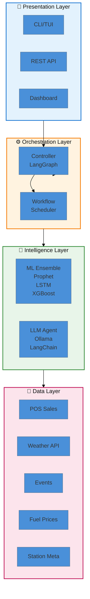
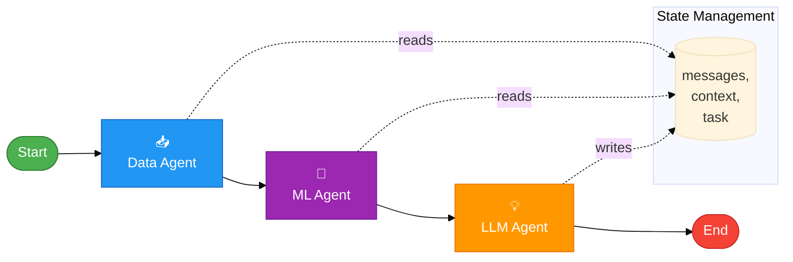
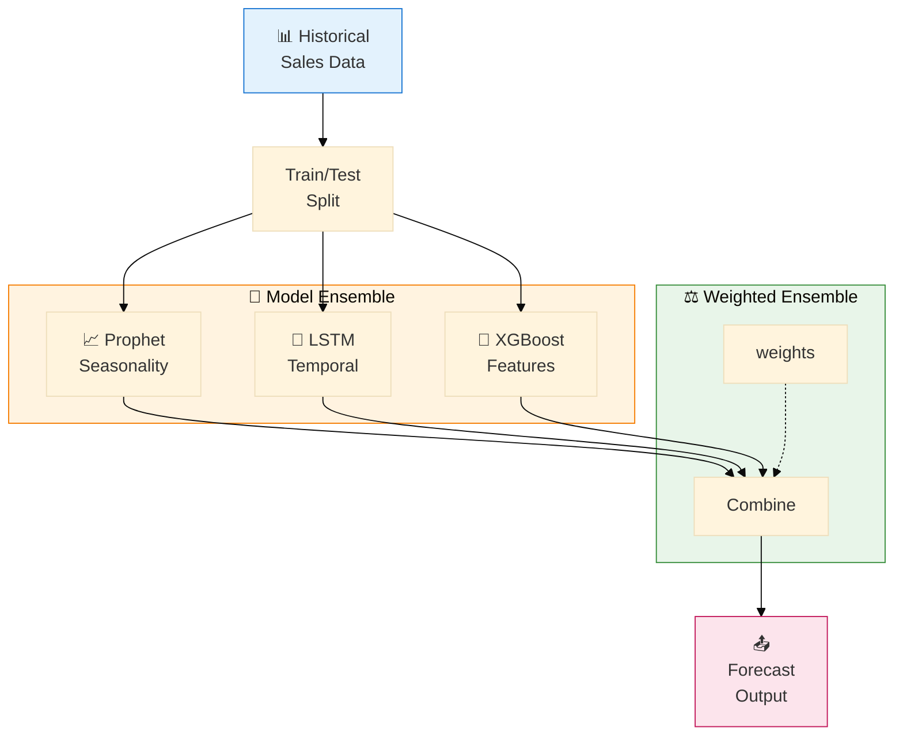
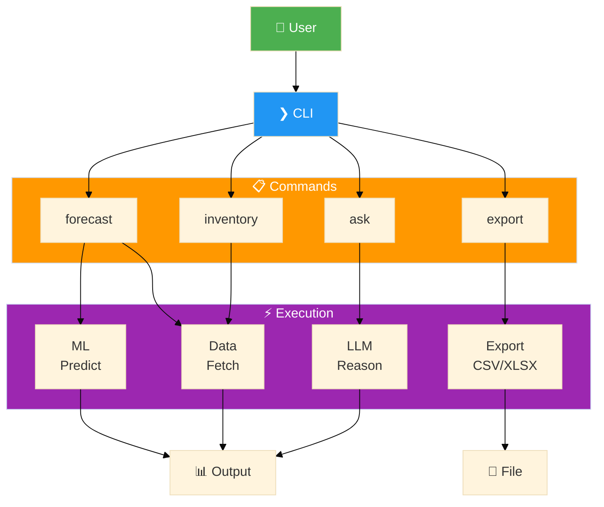
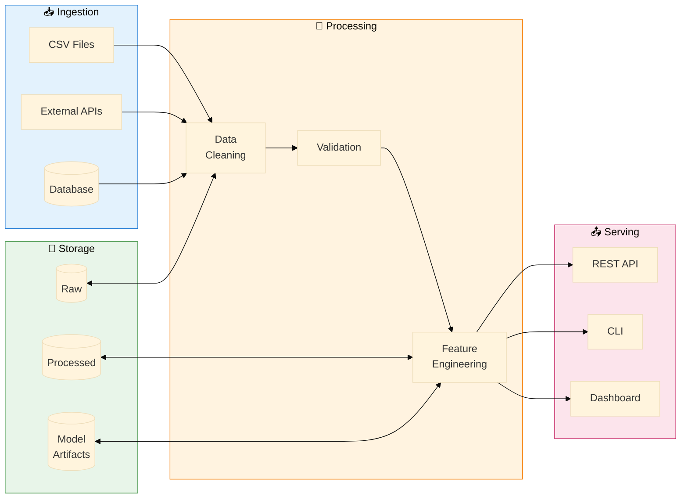

# CYSMIC Fuel Forecasting - Architecture Diagrams

> Rendered at [mermaid.live](https://mermaid.live) - export as PNG/SVG

---

## System Architecture

---

## Agentic Workflow

---

## ML Ensemble Pipeline

---

## CLI Commands Flow

---

## Data Pipeline

