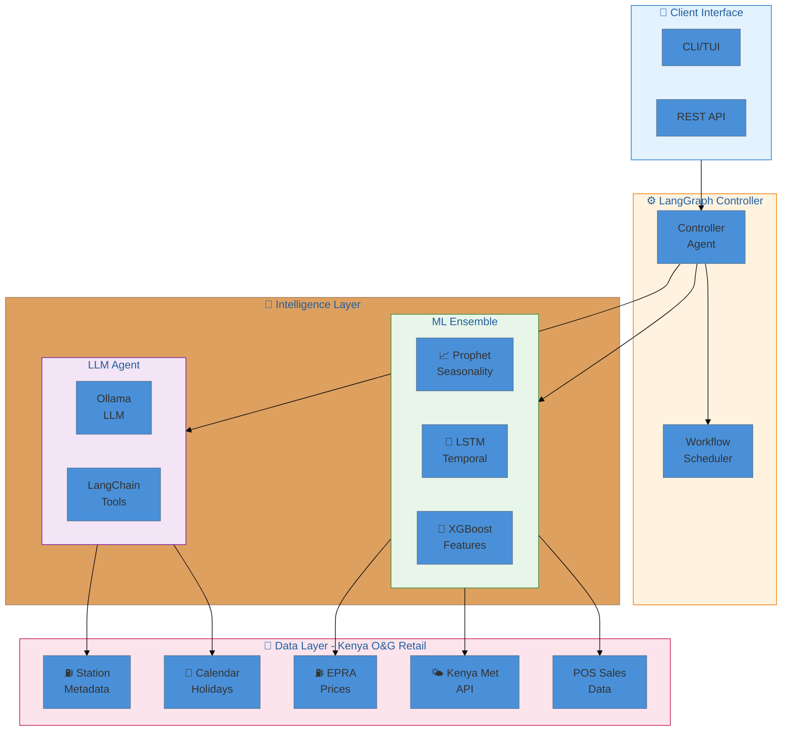
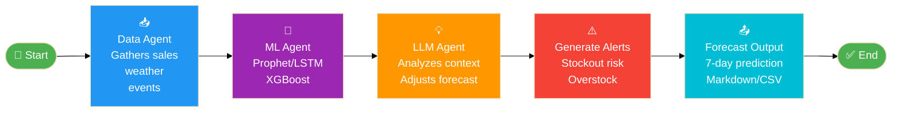
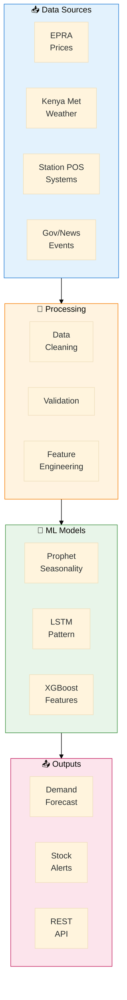
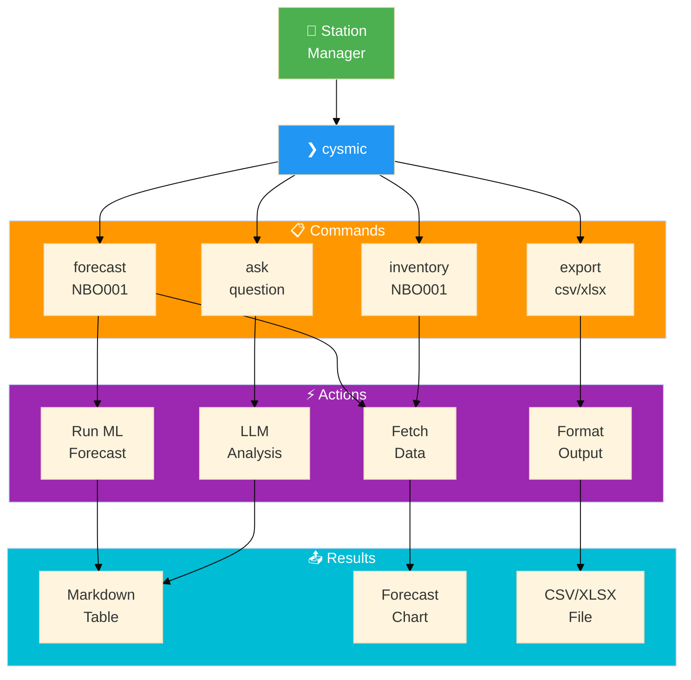
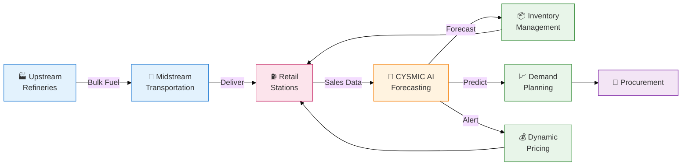

# CYSMIC Fuel Forecasting - Architecture Diagrams

> Render at [mermaid.live](https://mermaid.live) - Kenya Oil & Gas Retail AI System

---

## System Architecture - Fuel Demand Forecasting



---

## Agentic Workflow - Demand Forecasting



---

## Kenya Fuel Retail Data Flow



---

## CLI Workflow - Fuel Forecasting Commands



---

## Inventory Management Flow

```mermaid
%%{init: {'theme': 'base'}}%%
flowchart LR
    Start([Start]) --> Check[📦 Check<br/>Inventory]
    
    Check --> Level{Stock<br/>Level?}
    
    Level -->|OK (>30%)| Monitor[👀 Monitor]
    Level -->|LOW (15-30%)| Alert1[⚠️ Alert<br/>Reorder]
    Level -->|CRITICAL (<15%)| Alert2[🚨 Urgent<br/>Restock]
    
    Monitor --> Predict[📈 Predict<br/>7-day demand]
    Predict --> Enough{Enough<br/>stock?}
    
    Enough -->|Yes| Wait[⏰ Wait]
    Enough -->|No| Recommend[📝 Recommend<br/>order qty]
    
    Alert1 --> Recommend
    Alert2 --> Recommend
    
    Recommend --> Order[🛒 Create<br/>Order]
    Order --> End([✅ End])
    Wait --> End
    
    style Start fill:#4caf50,color:#fff
    style Check fill:#2196f3,color:#fff
    style Level fill:#ff9800,color:#fff
    style Alert1 fill:#ff9800,color:#fff
    style Alert2 fill:#f44336,color:#fff
    style Predict fill:#9c27b0,color:#fff
    style Recommend fill:#00bcd4,color:#fff
    style Order fill:#4caf50,color:#fff
    style End fill:#4caf50,color:#fff
```

---

## Kenya O&G Retail Value Chain


