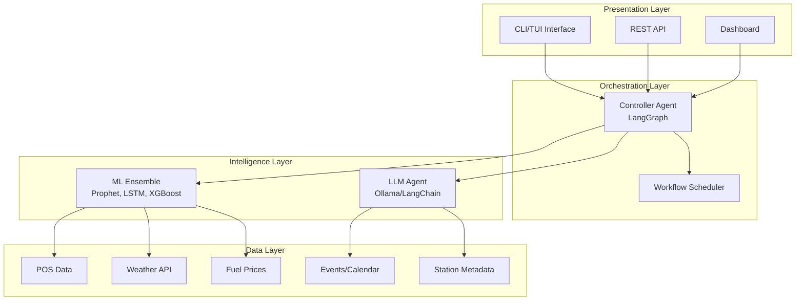
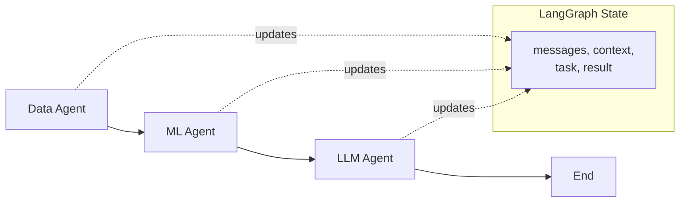
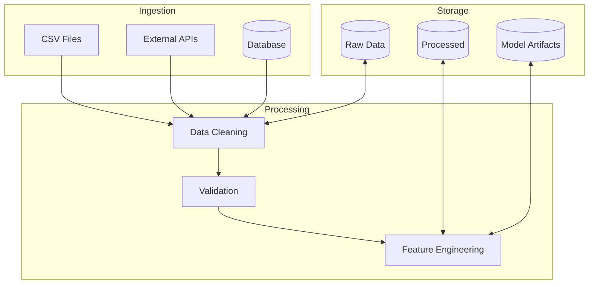
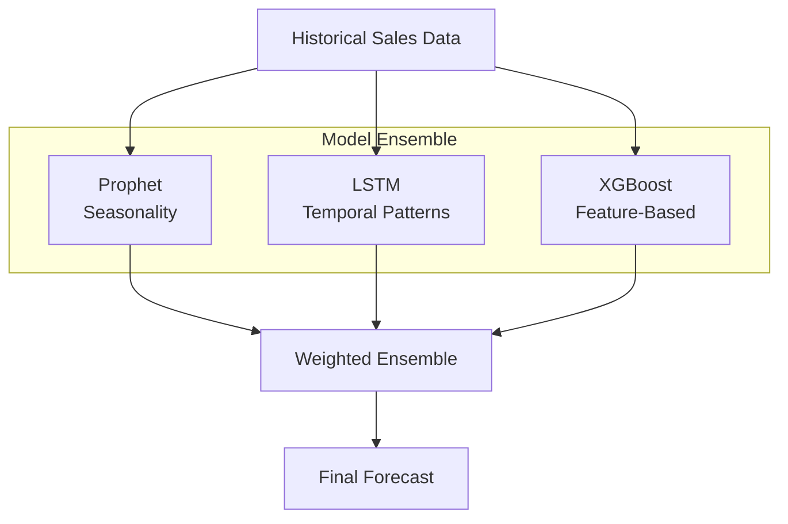
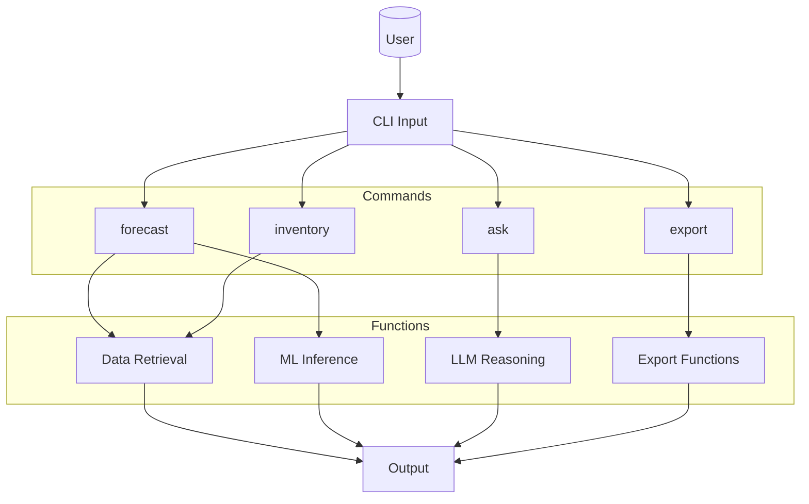
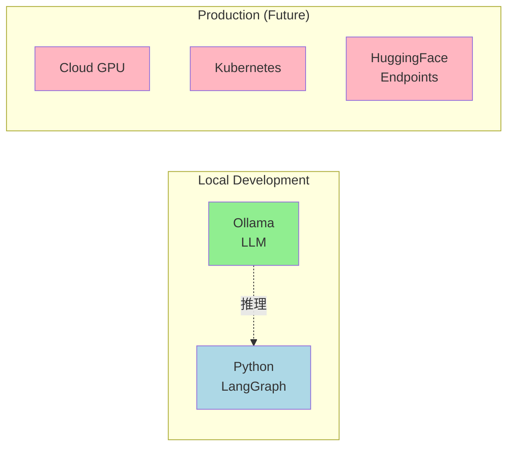
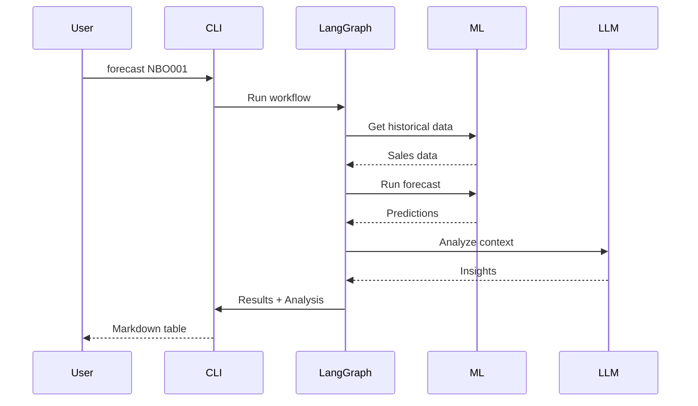
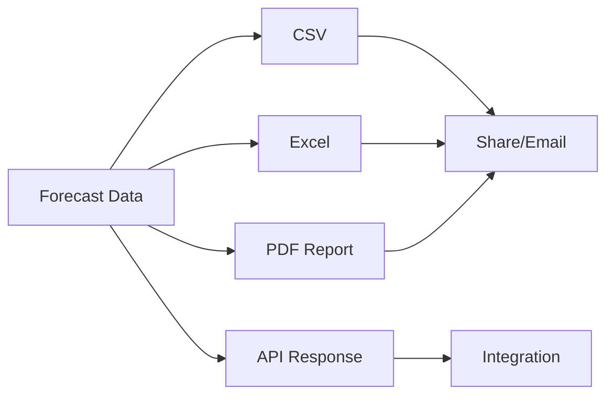

# CYSMIC Fuel Forecasting - Architecture Diagrams

> These diagrams use Mermaid.js. Render in GitHub, VS Code, or [Mermaid Live Editor](https://mermaid.live)

---

## System Architecture Overview

---

## Agentic Workflow (LangGraph)

---

## Data Pipeline

---

## ML Ensemble Model

---

## CLI Interface

---

## Deployment Architecture

---

## Data Flow Example

---

## Export Pipeline

